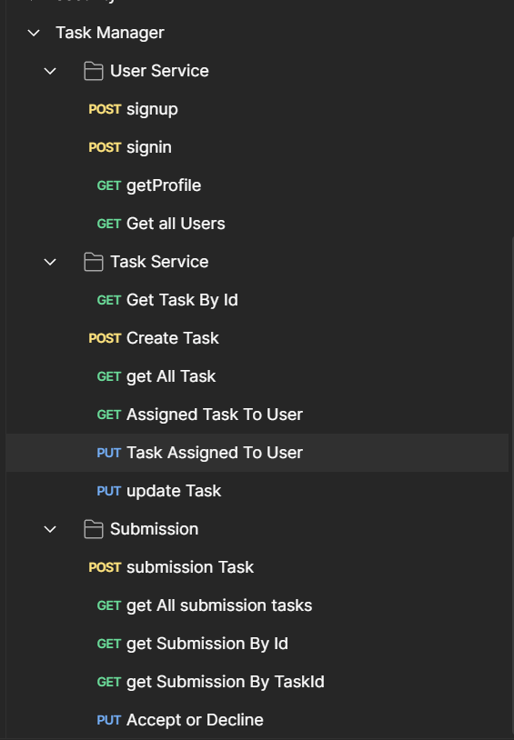
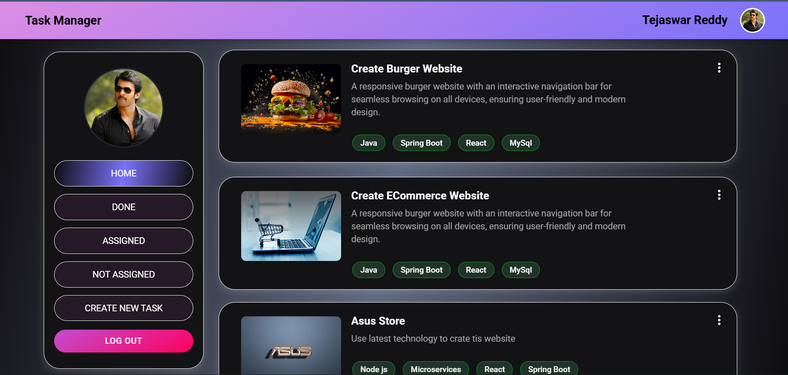

# 🗂 Task Manager - Microservices Architecture

A **Task Management Application** built using **Spring Boot Microservices** (Java) for the backend and **React.js** for the frontend.
It allows **Admins** to create and assign tasks, and **Users** to view, submit, and track task progress — all managed via secure authentication and API gateway routing.

---

## 🚀 Features

### 👨‍💻 Admin

* Create, update, and delete tasks
* Assign tasks to users
* View all tasks and their statuses

### 👤 User

* View assigned tasks
* Submit completed tasks
* Track progress and notifications

### 🔐 Authentication & Security

* JWT-based authentication
* Role-based authorization (ADMIN / USER)
* Secure API gateway routing

---

## 🛠 Tech Stack

### **Backend**

* **Java 17**
* **Spring Boot** (REST API, Security, Feign Clients)
* **Spring Cloud Netflix Eureka** (Service Discovery)
* **Spring Cloud Gateway** (API Gateway)
* **MySQL** (Database)
* **Maven** (Build Tool)

### **Frontend**

* **React.js** (Vite)
* **Redux Toolkit** (State Management)
* **Tailwind CSS** + **Material UI**
* **Axios** (API Requests)

---

## 📂 Project Structure

### **Backend Services**

* **eureka-service** – Service Registry
* **gateway-service** – API Gateway & Routing
* **user-service** – Manages authentication, authorization, and user data
* **task-service** – Manages task creation, assignment, and tracking
* **task-submission-service** – Handles task submissions and statuses

### **Frontend**

* **Pages**

  * Login / Signup
  * Dashboard
  * Task List
  * Task Submission
* **Redux Slices**

  * AuthSlice
  * TaskSlice
  * SubmissionSlice

---

## ⚙️ Setup & Run

### **Backend**

1. Clone the repository:

   ```bash
   git clone https://github.com/your-username/Task-Manager-Microservices.git
   cd Task-Manager-Microservices
   ```
2. Start **PostgreSQL** and create databases for each microservice.
3. Update `application.yml` or `application.properties` in each service with your DB credentials.
4. **Start services in the following order** (from IntelliJ or terminal):

   1. **eureka-service**
   2. **gateway-service**
   3. **user-service**
   4. **task-service**
   5. **task-submission-service**

---

### **Frontend**

1. Navigate to the frontend folder:

   ```bash
   cd frontend
   ```
2. Install dependencies:

   ```bash
   npm install
   ```
3. Run development server:

   ```bash
   npm run dev
   ```
4. Open browser at:

   ```
   http://localhost:5173
   ```

---

## 🔗 API Endpoints

**User Service**

* `POST /auth/signup` – Create new user
* `POST /auth/login` – Login & get JWT token

**Task Service**

* `POST /tasks` – Create a task (Admin)
* `GET /tasks` – Get all tasks
* `PUT /tasks/{id}` – Update task

**Task Submission Service**

* `POST /submissions` – Submit task
* `GET /submissions` – Get submissions

---

## 📸 Screenshots




---

## 👨‍💻 Author

**Tejaswar Reddy Kasa**
[GitHub](https://github.com/kasatejaswarreddy0512)

---


If you want, I can now add a **system architecture diagram** to visually show Eureka → Gateway → Microservices → Frontend flow. That will make the README much more professional for GitHub.
